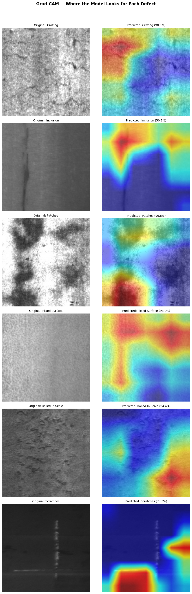
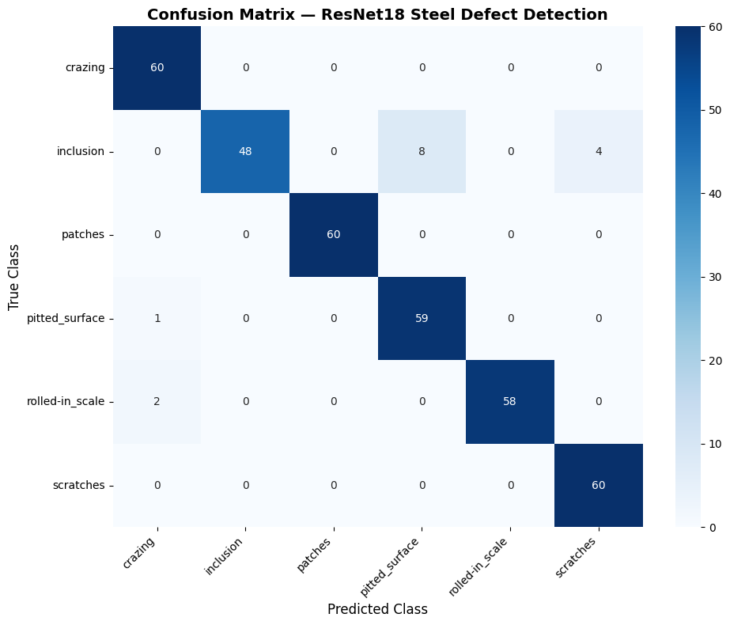
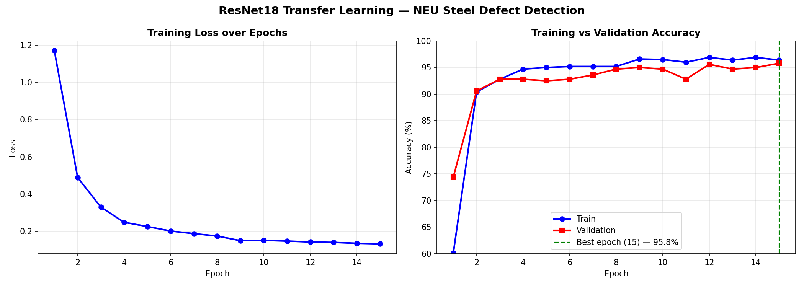

# Steel Surface Defect Detector

Steel manufacturing loses billions every year to surface defects that slip through quality control. This project builds an end-to-end computer vision system that detects defect types on steel surfaces, explains what caused them, and shows exactly where on the image the model made its decision.

Built with POSCO's Pohang operations in mind — one of the largest steel mills in the world and a city where this kind of tool has real industrial relevance.

## Live Demo

[🔬 Try the Live Demo](https://steel-defect-detector-r2krsf2m5fvscfmzpetxa5.streamlit.app)

[📊 Explore the Dataset](https://steel-defect-eda.streamlit.app/)

## How It Works

Upload a steel surface image. A fine-tuned ResNet18 model classifies the defect type and returns a confidence score. If confidence is below 70% the system flags it for manual inspection rather than guessing. For confident predictions, Grad-CAM highlights which part of the image drove the decision, and the Claude API generates a plain-English engineering analysis covering what the defect is, what likely caused it in the rolling process, and what the production team should do.

## Dataset

NEU Steel Surface Defect Dataset — 1,800 images across 6 classes: Crazing, Inclusion, Patches, Pitted Surface, Rolled-in Scale, Scratches

## Results

| Model | Validation Accuracy |
|---|---|
| Logistic Regression baseline | 41.4% |
| ResNet18 transfer learning | 95.8% |

Transfer learning demonstrates a 54.4 percentage point improvement over the logistic regression baseline — empirically justifying the use of pretrained convolutional feature detectors for steel defect classification.

## Explainability & Evaluation

**Grad-CAM — where the model looks for each defect type:**

**Confusion matrix — inclusion is the hardest class to separate from pitted surface and scratches:**

**Training curves — best validation accuracy (95.8%) reached at epoch 15:**

## Why Each Feature Exists

Grad-CAM is there because blindly trusting a black box in industrial quality control is dangerous — engineers need to see what the model is looking at. The confidence rejection option exists for the same reason. The LLM layer exists because knowing the defect type is only half the answer — a quality engineer needs to know what to do about it.

## Notebook

Full training and evaluation code: [`Steel_Defect_Detector.ipynb`](Steel_Defect_Detector.ipynb)

The notebook is large and may not render directly on GitHub — view it on nbviewer instead:
[📓 View Notebook on nbviewer](https://nbviewer.org/github/KaziZaber/steel-defect-detector/blob/main/Steel_Defect_Detector.ipynb)

## Tech Stack

Python | PyTorch | Claude API | Streamlit | Grad-CAM

## Status

In active development — started April 26, 2026 — live Streamlit app deployed
